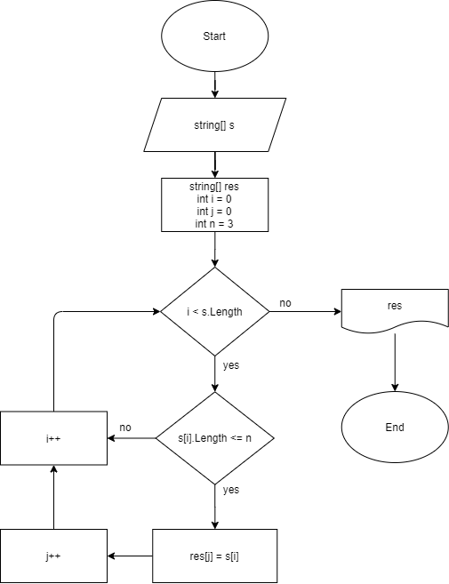

# Итоговая проверочная работа

## Задача:

 Написать программу, которая из имеющегося массива строк формирует новый массив из строк, длина которых меньше, либо равна 3 символам. Первоначальный массив можно ввести с клавиатуры, либо задать на старте выполнения алгоритма. При решении не рекомендуется пользоваться коллекциями, лучше обойтись исключительно массивами.

 ## Алгоритм решения:
 1. Перебираем исходный массив.
 2. Проверяем каждое значение массива на условие: ***длина строки меньше, либо равна 3 символам.***
 3. Если условие выполняется, то записываем значение в новый массив.
 4. Выполняем пункты ***2*** и ***3*** до тех пор пока не закончатся значения в исходном массиве.
 5. Возвращаем новый заполненный массив.

 ## Блок-схема алгоритма: 
 

